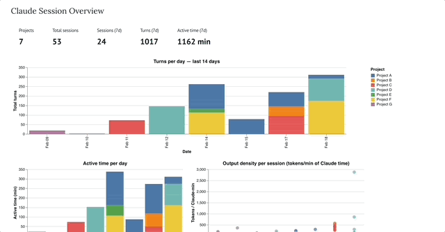

# Claude Code Session Marimo Explorer

An interactive [Marimo](https://github.com/marimo-team/marimo) notebook for visualizing your [Claude Code](https://claude.ai/code) session logs — see how you spend time across projects, drill into individual sessions, and understand your interaction patterns with Claude.


---

## Overview

Claude Code stores every conversation as `.jsonl` files in `~/.claude/projects/`. This notebook reads those files and turns them into an interactive dashboard with two views:

**Macro overview** — across all your projects over the last 7, 14, or 30 days:
- Stat cards: total sessions, turns, and active time for the selected window
- Turns per day (stacked bar by project)
- Active time per day (stacked bar by project)
- Output density per session — tokens Claude generated per minute of its active time

**Session deep-dive** — pick a project and session to see:
- Compressed swimlane timeline: every turn colored by who was "working" (Claude generating, tool executing, or you reading/typing)
- Response time distribution histogram
- Cumulative time chart showing how Claude vs. tool vs. you time accumulates
- Summary stats: active/idle split, turn counts, avg latency, token usage, cache hit rate, output density, session type (code-heavy / mixed / prose)



---

## Features

- **Selectable time window** — toggle between 7, 14, and 30 days in the macro overview
- **Idle filtering** — gaps > 30 min are excluded from all time calculations so weekend breaks don't inflate numbers
- **Tool time as a first-class category** — `assistant → user` gaps where the next message contains `tool_result` blocks are classified as tool execution time, not your time
- **Output density** — tokens/min of Claude time, a rate metric that's comparable across sessions of different lengths and types
- **Session type detection** — code fence ratio classifies sessions as 💻 code-heavy, 🔀 mixed, or 💬 thinking/prose
- **Compressed timeline** — idle gaps are stripped from the x-axis so short active turns aren't squished against long idle ones

---

## Installation

### 1. Install Marimo

```bash
pip install marimo
```

Or with conda:

```bash
conda install -c conda-forge marimo
```

### 2. Install notebook dependencies

```bash
pip install altair pandas
```

### 3. Clone this repo

```bash
git clone <repo-url>
cd session-explorer
```

---

## Usage

```bash
marimo edit claude_session_explorer_molab.py
```

This opens the notebook in your browser. The notebook reads directly from `~/.claude/projects/` — no configuration needed as long as you have Claude Code installed and have run at least one session.

**Navigating the notebook:**

1. The **macro overview** loads automatically at the top — use the **Window** dropdown to switch between 7 / 14 / 30 days
2. Use the **Project** dropdown to select a project
3. Click a row in the session table to load that session
4. Scroll down to see the per-session charts and summary stats

---

## Requirements

- Python 3.9+
- [Claude Code](https://claude.ai/code) installed with at least one session logged in `~/.claude/projects/`
- `marimo >= 0.17.6`
- `altair`
- `pandas`
